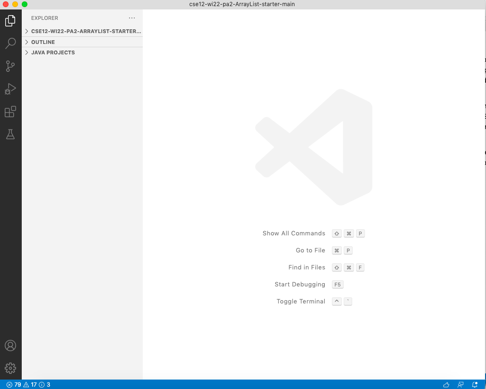
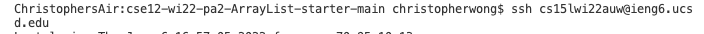
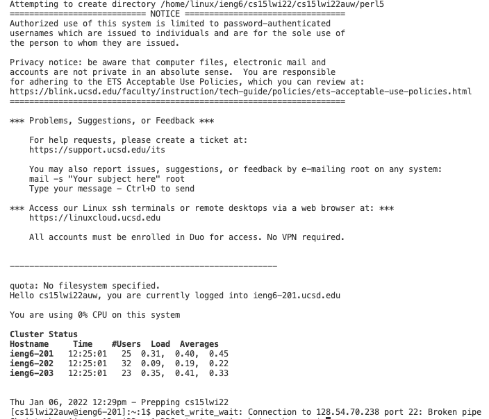
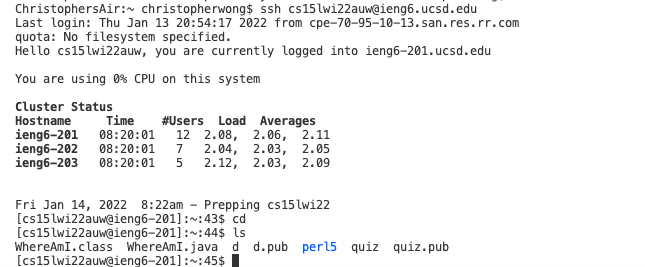
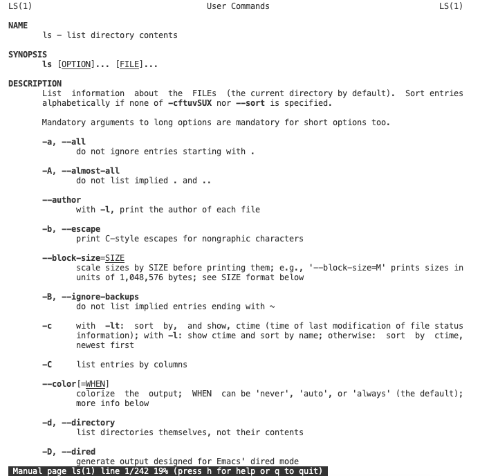
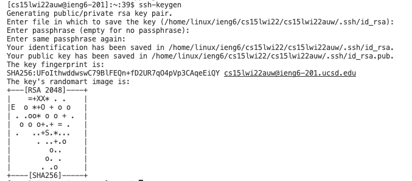
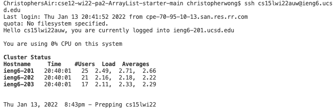
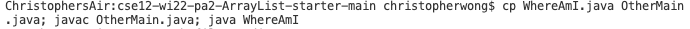

# Lab Report Week 2

This page will briefly talk about how to set up and connect appropriately to one of the server provided by UCSD. In order to do so, we need an IDE. The recommended IDE is Visual Studio Code and here is the walk through of how to installing VS code.
&nbsp;

&nbsp;

**VSCode installation**

First of all, download VS code at [Link](https://code.visualstudio.com) and follow the instructions to install it on the compuer. After that, you should see a window as below.

If you have windows, you will need to install a program called OpenSSH at [Link](https://docs.microsoft.com/en-us/windows-server/administration/openssh/openssh_install_firstuse). 

&nbsp;

**Remotely Connecting**

After, open the terminal in VSCode(Ctrl or Command + ` or open it through the menu bar) and type in the command shown in the picture below whereas auw should be different for other users.

Afterward, it will prompt you to enter password to your account. Enter your passwords and you are successfully connected to the server as below.

&nbsp;

**Useful Commands**

Later you can test out different commands such as -cd and -ls which would be helpful in terms of managing directory. See below.

You can also type -man ls to see the whole list of commands.

&nbsp;

**Move files with scp**

Now we can move files with scp command. Create a file and enter the command in the format below.

Use -ssh again to log in and enter -ls again. The file now is moving to server and could be run remotely.

&nbsp;

**Set up the key**

We can also save the key so that we do not have to enter the password every time. First type $ ssh-keygen. Type /Users/username/.ssh/id_rsa to save the key and eventually you will the photo below.

Now connect to the server with -ssh again and type -mkdir .ssh. Log out the server and type this command -scp /Users/joe/.ssh/id_rsa.pub cs15lwi22@ieng6.ucsd.edu:~/.ssh/authorized_keys and substitude the username and the path. After all, you should be able to connect to the server without password like this.

&nbsp;

**Optimization**

We can also optimize remote running by using the command below which can run multiple commands on the same line.

you can also use up-arrow to look for the previous command.