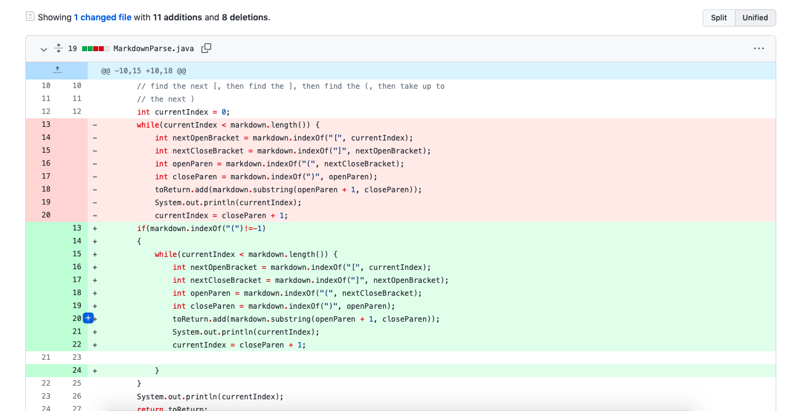

# **Lab Report Week 4**

## **#1**


Link to the file of the failure-inducing imput: [Link](https://github.com/johnsonli010801/markdown-parse/blob/main/woohoo.md)

Below is the symptom:

```
Exception in thread "main" java.lang.StringIndexOutOfBoundsException: begin 0, end -1, length 21
        at java.base/java.lang.String.checkBoundsBeginEnd(String.java:4601)
        at java.base/java.lang.String.substring(String.java:2704)
        at MarkdownParse.getLinks(MarkdownParse.java:19)
        at MarkdownParse.main(MarkdownParse.java:28)
```

Since none of ```"{"```, ```"}"```, ```"("```, ```")"``` are found, the value of index are negative which are out of bounds for built in substring method and caused the error.

&nbsp;
&nbsp;

## **#2**


Link to the file of the failure-inducing imput: [Link](https://github.com/johnsonli010801/markdown-parse/blob/main/cs1.md)

Below is the symptom:
```
[google.com]
```

It should not return the url since there is a space between the ```]``` and   ```(```, which would not create a link shortcut in markdown. In order to solve that, we just have to make sure there is no space in between.

&nbsp;

## **#3**
!Image(Screen Shot 2022-01-27 at 9.28.41 PM.png)

Link to the file of the failure-inducing imput: [Link](https://github.com/ucsd-cse15l-w22/markdown-parse/blob/main/test-file5.md)

Below is the symptom:
```
[page.com]
```
It should not return the url since there is word in between ```]``` and ```(``` which would not create a clickable link in markdown. In order to solve that, make sure ```]``` is right before ```)```.
