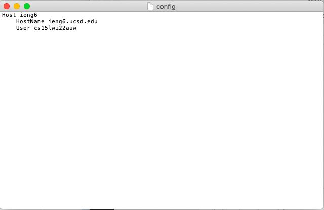
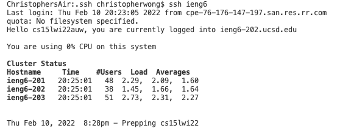
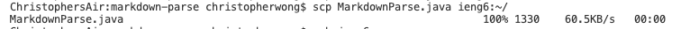

# **Lab Report Week 6**

I first change the directory to ~/.ssh using the command ``cd ~/.ssh`` and later open the file with the following code ``open -t config``. I used the Mac app TextEdit to edit the file then put in the code

&nbsp;

    Host ieng6
        HostName ieng6.ucsd.edu
        User cs15lwi22auw
 
&nbsp;
 
like below:

Now I can use just the alias to connect to the remote server as below.

I can also copy file to the server with the code ``scp MarkdownParse.java ieng6:~/``. 

