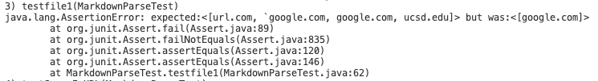

# **Lab Report Week 8**

Link to my implementation of MarkdownParse:[https://github.com/idmkris/markdown-parse](https://github.com/idmkris/markdown-parse).

&nbsp;

Link to the implementation of MarkdownParse I reviewed:[https://github.com/idmkris/week5](https://github.com/idmkris/week5)

&nbsp;

## **#Snippet 1**
Junit test code:

My implementation:

The implementation I reviewed

&nbsp;

## **#Snippet 2**

Junit test code:

My implementation:

The implementation I reviewed:

&nbsp;

## **#Snippet 3**

Junit test code:

my implementation:

The implementation I reviewed:

&nbsp;

## **#Answer**
For snippet one, I believe I can use stack to make sure every open bracket have a closed brackey after it. Otherwise, it is not a link.

For snippet two, I think I can use same algorithm as marked above but takes more than ten lines since nested link need more line to set the identify which link to print.

For snippet three, it will take more than 10 lines since I will have to make sure the brackets are in one line and there is a closed parenthesis and bracket for each opend ones.