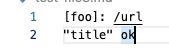

# **Lab Report Week 10**

## **Test 1**

I found the bug by using ``diff`` on the result. The result shown by the given implementation is ``[]`` while my implementation returns ``IndexOutOfBounds`` error. Therefore, my implementation is wrong since return an empty arraylist.

The bug is that my while loop would run out of the bounds in the method ``findClosedParen``. To fix the bug, I will add another condition in the while loop of my implementation. I will changed it from ``while (openParenCount > 0)`` to ``while (openParenCount > 0 && closeParen < markdown.length())``.

## **Test 2**

I found the bug by searching through manully. My implementation returns the link while the given implementation returns ``[]`` which is correct since there should not be space in a link.

The bug is that I did not add a condition to filter the space inside the parenthesis. To solve that, I add ``potentialLink.indexOf(" ") == -1`` to my if condition ``if(ppotentialLink.indexOf("\n") == -1)`` so it can prevent adding the link that has space in it to the final return arraylist.

